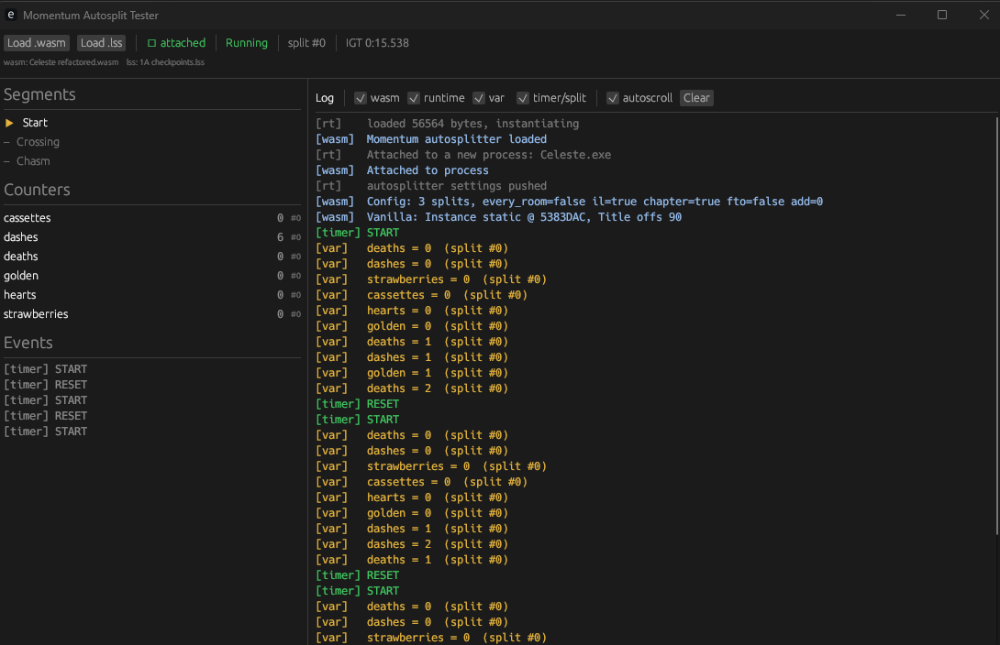

# AutoSplitter Momentum WASM

One `.wasm` per game. Read .lss file at run time.

## Layout

| Folder                  | What it is                                                                                                                                                            |
| ----------------------- | --------------------------------------------------------------------------------------------------------------------------------------------------------------------- |
| `autosplit-engine/`     | Shared, game-agnostic core (the `Game` trait + `run` loop, timer/IGT contract, settings parsing, counters, .NET/Mono memory helpers). Every game crate depends on it. |
| `autosplit-tester/`     | Native CLI host that mirrors momentum-app, loads a `.wasm` + a `.lss` and prints splits/vars.                                                                         |
| `autosplit-gui-tester/` | Native GUI host (egui) -> same runtime as the app, with live counters, segment progress, and a filterable log.                                                        |

## Prerequisites (once)

```bash
rustup target add wasm32-unknown-unknown
```

## Build a specific game's wasm

Build in the game directory direclty.

```bash
cd celeste-autosplitter   # or <game>-autosplitter
cargo build --release
# outuput -> target/wasm32-unknown-unknown/release/celeste_autosplitter.wasm
```

## Test it against the real game (CLI)

```bash
cd autosplit-tester
cargo run --release -- \
  ../celeste-autosplitter/target/wasm32-unknown-unknown/release/celeste_autosplitter.wasm \
  "path/to/category.lss"
```

Then launch the game and play. The tester prints the parsed `Config:` line, backend detection, and `SPLIT name segment=… total=…` per split.
/!\ On Windows the tester exe locks while running sostop it
before rebuilding (`taskkill //F //IM autosplit-tester.exe`).

### GUI tester

For a graphical view :

```bash
cd autosplit-gui-tester
cargo run --release
```

In the window: **Load .wasm**, then **Load .lss**.
Launch the game: the attach dot turns green, the segment list highlights the current split etc.



`set_variable`, and the right-hand log streams `wasm` / `runtime` / `var` / `timer` lines with a
checkbox per category to hide noise. It drives the wasm through the identical runtime API as the
app, so a wasm that behaves here behaves in the app.

## Deploy

TODO: pipeline to build and publish edited wasm game.

## Add a new game

A game crate is thin: implement the `autosplit-engine` `Game` trait (memory reads + split grammar)
the engine handles attach, settings, the tick loop, and the timer contract. Copy
`celeste-autosplitter/`'s shape.
